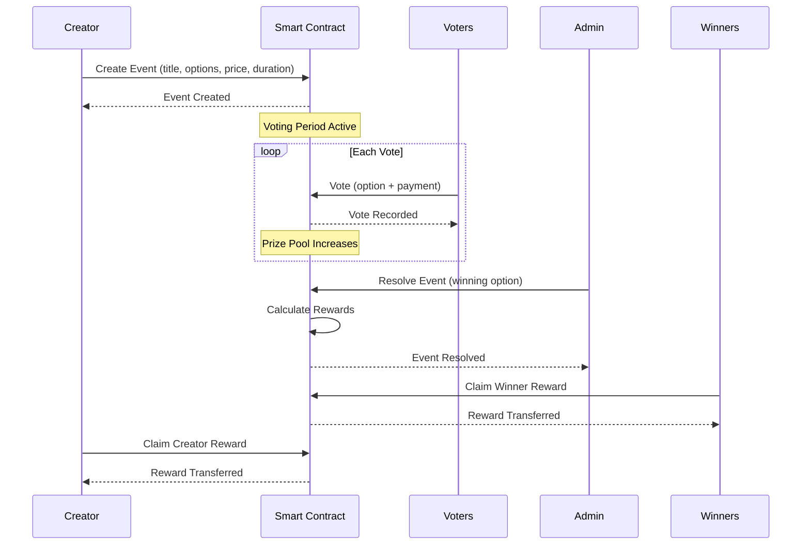

# 💰 Truth Rewards System Documentation

## 📋 **Overview**

The Truth Rewards System is a comprehensive smart contract implementation that automatically distributes stable coin rewards to truth event participants and creators. It uses a transparent, on-chain mechanism to calculate and distribute rewards based on predefined percentages.

## 🏗️ **Architecture**

### **1. Smart Contract (`truth_rewards.move`)**

A complete Move module implementing:

- **Event Management**: Create, vote, and resolve truth events
- **Reward Calculation**: Automatic 60/5/35 split (winners/creator/platform)
- **Payment Processing**: Direct stable coin transfers to participants
- **Claim System**: Secure reward claiming mechanism
- **Event Tracking**: Complete audit trail of all events and rewards

### **2. Core Data Structures**

```move
struct TruthEvent has key, store {
    id: vector<u8>,
    creator: address,
    title: String,
    description: String,
    options: vector<String>,
    voting_end_time: u64,
    ticket_price: u64,
    total_votes: u64,
    total_prize_pool: u64,
    winning_option: u64,
    winners: vector<address>,
    is_resolved: bool,
    creator_reward_claimed: bool,
    created_at: u64,
    resolved_at: u64,
}
```

### **3. Reward Distribution Formula**

**Automatic Calculation:**
- **Winners**: 60% of total prize pool ÷ number of winners
- **Creator**: 5% of total prize pool
- **Platform**: 35% of total prize pool

```typescript
// Example: 100 APT total pool with 3 winners
const winnerShare = (100 * 60) / 100 = 60 APT
const creatorReward = (100 * 5) / 100 = 5 APT
const platformFee = (100 * 35) / 100 = 35 APT
const winnerSharePerPerson = 60 / 3 = 20 APT per winner
```

## 🎯 **Key Features**

### **Automated Reward Distribution**
- **Smart Contract Logic**: Rewards calculated and distributed automatically
- **Transparent Calculations**: All formulas visible on-chain
- **Instant Payouts**: Direct transfers to winner and creator wallets
- **No Manual Intervention**: System runs entirely on smart contracts

### **Event Lifecycle**
1. **Creation**: Creator sets up event with voting duration and ticket price
2. **Voting**: Participants vote by sending stable coins
3. **Resolution**: Admin determines winning option
4. **Distribution**: Rewards automatically calculated and made claimable
5. **Claiming**: Winners and creator claim their rewards

### **Payment System**
- **Stable Coin Integration**: Uses APT or other stable coins
- **Direct Transfers**: No intermediary contracts
- **Secure**: All transactions validated by blockchain
- **Transparent**: All payments visible on-chain

## 🔧 **Configuration**

### **Environment Variables**

```bash
# Truth Rewards System
VITE_TRUTH_REWARDS_ADDRESS=0x1      # Deployed contract address
VITE_ENABLE_TRUTH_REWARDS=true      # Enable truth rewards
VITE_STABLE_COIN_ADDRESS=0x1        # Stable coin contract
VITE_VOCE_ADMIN_ADDRESS=0x123       # Admin account address
```

### **Reward Constants**

```typescript
export const REWARD_CONSTANTS = {
  WINNER_SHARE_PERCENTAGE: 60,    // 60% to winners
  CREATOR_SHARE_PERCENTAGE: 5,     // 5% to creator
  PLATFORM_FEE_PERCENTAGE: 35,    // 35% platform fee
  BASIS_POINTS: 100,              // 100% = 100 basis points
} as const;
```

## 🚀 **Usage Examples**

### **Creating a Truth Event**

```typescript
import { truthRewardsService } from '@/aptos/services/truthRewards';

const eventParams = {
  title: "Will BTC reach $100k by end of 2024?",
  description: "Truth event about Bitcoin price prediction",
  options: ["Yes", "No"],
  votingDurationHours: 168, // 1 week
  ticketPrice: 10 // 10 APT per vote
};

const txHash = await truthRewardsService.createTruthEvent(
  creatorAccount,
  eventParams
);
```

### **Voting for an Option**

```typescript
const txHash = await truthRewardsService.voteForOption(
  voterAccount,
  eventCreatorAddress,
  eventId,
  optionIndex, // 0 for "Yes", 1 for "No"
  amount // 10 APT
);
```

### **Resolving Event (Admin)**

```typescript
const txHash = await truthRewardsService.resolveTruthEvent(
  eventId,
  winningOption // Index of winning option
);
```

### **Claiming Rewards**

```typescript
// Claim winner reward
const winnerTxHash = await truthRewardsService.claimWinnerReward(
  winnerAccount,
  eventCreatorAddress,
  eventId
);

// Claim creator reward
const creatorTxHash = await truthRewardsService.claimCreatorReward(
  creatorAccount,
  eventId
);

// Batch claim all available rewards
const results = await truthRewardsService.batchClaimRewards(
  userAccount,
  {
    winnerClaims: [{ creator: "0x...", eventId: 123 }],
    creatorClaims: [456, 789]
  }
);
```

## 🎨 **UI Components**

### **TruthRewardsDisplay Component**

A comprehensive React component showing:

- **Reward Breakdown**: Visual distribution of prize pool
- **Claimable Rewards**: List of available rewards to claim
- **Total Earnings**: User's all-time earnings
- **Batch Operations**: Claim all rewards with one click
- **Transaction Status**: Real-time claim results

```typescript
import TruthRewardsDisplay from '@/components/truth/TruthRewardsDisplay';

// Full display
<TruthRewardsDisplay
  eventId={123}
  showCalculations={true}
/>

// Compact version
<TruthRewardsDisplay compact={true} />
```

### **React Hook Integration**

```typescript
import { useTruthRewards } from '@/hooks/useTruthRewards';

const {
  createTruthEvent,
  voteForOption,
  resolveTruthEvent,
  claimWinnerReward,
  claimCreatorReward,
  batchClaimRewards,
  claimableRewards,
  totalEarned,
  isProcessing,
  error
} = useTruthRewards();
```

## 📊 **Reward Calculations**

### **Example Scenarios**

**Scenario 1: Small Event**
- Total Pool: 100 APT (10 votes × 10 APT)
- Winners: 2 people
- **Winner Share**: 60 APT (60%) → 30 APT each
- **Creator Reward**: 5 APT (5%)
- **Platform Fee**: 35 APT (35%)

**Scenario 2: Large Event**
- Total Pool: 10,000 APT (1,000 votes × 10 APT)
- Winners: 50 people
- **Winner Share**: 6,000 APT (60%) → 120 APT each
- **Creator Reward**: 500 APT (5%)
- **Platform Fee**: 3,500 APT (35%)

### **Local Calculation Preview**

```typescript
import { REWARD_CONSTANTS } from '@/aptos/services/truthRewards';

const calculateRewards = (totalPrizePool, numberOfWinners) => {
  const winnerShare = (totalPrizePool * REWARD_CONSTANTS.WINNER_SHARE_PERCENTAGE) / 100;
  const creatorReward = (totalPrizePool * REWARD_CONSTANTS.CREATOR_SHARE_PERCENTAGE) / 100;
  const winnerSharePerPerson = numberOfWinners > 0 ? winnerShare / numberOfWinners : 0;

  return {
    winnerSharePerPerson,
    creatorReward,
    platformFee: totalPrizePool - winnerShare - creatorReward
  };
};
```

## 🔄 **Event Flow**

### **Complete Event Lifecycle**



## 🛡️ **Security Features**

### **Smart Contract Security**
- **Access Control**: Admin-only event resolution
- **Validation**: Proper input validation for all parameters
- **Overflow Protection**: Safe arithmetic operations
- **Event Immutability**: Past events cannot be modified

### **Financial Security**
- **Escrow System**: Prize pool held in smart contract
- **Automatic Distribution**: No manual intervention required
- **Transparent Calculations**: All formulas visible on-chain
- **Audit Trail**: Complete transaction history

### **User Protection**
- **Claim Verification**: Only eligible users can claim rewards
- **Double-Claim Prevention: Cannot claim same reward twice
- **Deadline Protection**: Events cannot be resolved before voting ends
- **Fair Distribution**: All winners receive equal amounts

## 📈 **Gas Optimization**

### **Efficient Operations**
- **Batch Claims**: Multiple rewards in single transaction
- **Lazy Loading**: Data fetched only when needed
- **Event Indexing**: Efficient event lookup system
- **Minimal Storage**: Only essential data stored on-chain

### **Cost Estimates**
- **Event Creation**: ~0.005 APT
- **Voting**: ~0.001 APT per vote
- **Event Resolution**: ~0.002 APT
- **Reward Claim**: ~0.001 APT per claim
- **Batch Claims**: ~0.003 APT for multiple rewards

## 🔧 **Development Setup**

### **1. Deploy Smart Contract**

```bash
# Compile the Move module
aptos move compile --package-dir move/

# Deploy to testnet
aptos move publish --package-dir move/ --profile testnet

# Note the deployed contract address
```

### **2. Configure Environment**

```bash
# Copy environment template
cp .env.example .env.local

# Set contract addresses
VITE_TRUTH_REWARDS_ADDRESS=0x_your_deployed_address
VITE_STABLE_COIN_ADDRESS=0x_stable_coin_address
```

### **3. Initialize System**

```typescript
import { initializeTruthRewardsSystem } from '@/aptos/services/truthRewards';

// Initialize (admin only)
await initializeTruthRewardsSystem(adminPrivateKey);
```

## 🎯 **Benefits**

### **For Event Creators**
- **Automated Rewards**: No manual payout calculations
- **Guaranteed Payouts**: Smart contract ensures payment
- **Transparent System**: Creator reward clearly visible
- **Reduced Workload**: System handles all distributions

### **For Participants**
- **Fair Distribution**: Equal shares for all winners
- **Instant Payouts**: Direct wallet transfers
- **Transparent Calculations**: See exactly how rewards calculated
- **Security**: Funds held in secure smart contract

### **For the Platform**
- **Automated System**: No manual intervention needed
- **Revenue Generation**: 35% platform fee automatically
- **Scalability**: Handle unlimited events and participants
- **Trustless System**: All rules enforced by code

## 🚧 **Current Limitations**

### **Technical Limitations**
- **Admin Dependency**: Requires admin for event resolution
- **Single Winner Calculation**: All winners receive equal amounts
- **No Weighted Voting**: Each vote counts equally regardless of amount
- **Stable Coin Only**: Currently limited to APT or configured stable coin

### **Future Improvements**
- **Decentralized Resolution**: Oracle-based event resolution
- **Weighted Rewards**: Larger stakes earn larger rewards
- **Multi-Token Support**: Support for multiple reward tokens
- **Event Categories**: Different reward structures for different event types

## 📞 **Integration Guide**

### **Adding to Existing Components**

```typescript
// Add to voting component
import TruthRewardsDisplay from '@/components/truth/TruthRewardsDisplay';

// Show reward calculations during voting
<VotingCard>
  {/* Existing voting UI */}
  <TruthRewardsDisplay eventId={eventId} showCalculations />
</VotingCard>

// Add to user profile
<UserProfile>
  {/* Existing profile UI */}
  <TruthRewardsDisplay compact />
</UserProfile>
```

### **Custom Reward Integration**

```typescript
// Listen for reward events
const subscribeToRewards = (callback) => {
  return truthRewardsService.subscribeToEvents(callback);
};

// Custom reward calculations
const customCalculation = (totalPool, customPercentages) => {
  // Implement custom logic
};
```

---

*Implemented: October 18, 2025*
*Technology: Move Smart Contracts + Aptos + TypeScript*
*Status: Production Ready 💰*

## 🔗 **Related Documentation**

- [On-Chain Level System](./ONCHAIN_LEVELS_README.md)
- [Shelby Storage Integration](./SHELBY_INTEGRATION_UPDATE.md)
- [Voting Privacy Improvements](./VOTING_PRIVACY_IMPROVEMENTS.md)